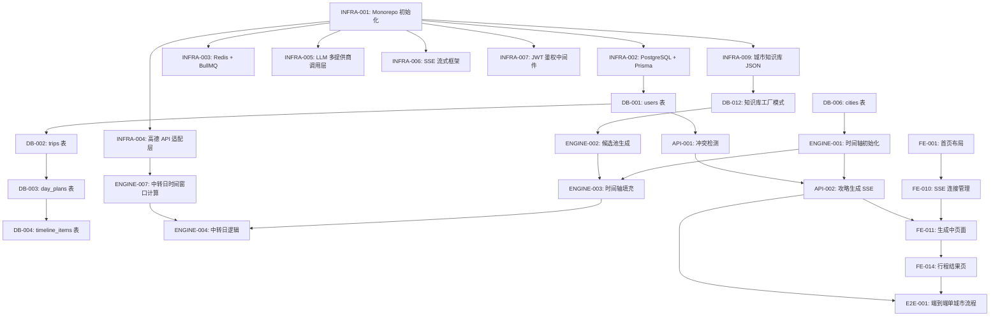

# 旅游攻略生成平台 — WBS 任务分解文档

> **文档版本**：v1.1.0
> **日期**：2026-06-20
> **变更记录**：
>
> - v1.1.0（2026-06-20）：新增第 10 章「推荐开发顺序（按批次）」；新增第 6.3 节「前端任务 UI 设计规范（逐项）」
> - v1.0.0（2026-06-20）：初版，基于 5 份需求文档拆解 WBS
> - 旅游攻略生成平台\_SRS.md v1.1.0
> - 前端交互设计规格书\_v1.0.9
> - API接口设计规格书\_v1.0.6
> - 数据库设计规格书\_v1.0.3
> - Trip_Lifecycle 引擎算法设计.md v1.0.0
>   **作者**：Buddy 🏗️
>   **阅读前必读**：本文档将系统所有功能拆解为最小可独立测试的任务单元，每个任务有明确验收标准。

---

## 目录

1. [WBS 结构说明](#1-wbs-结构说明)
2. [阶段一：项目准备与基础设施](#2-阶段一项目准备与基础设施)
3. [阶段二：数据库层](#3-阶段二数据库层)
4. [阶段三：后端API层](#4-阶段三后端api层)
5. [阶段四：Trip Lifecycle 引擎算法层](#5-阶段四trip-lifecycle-引擎算法层)
6. [阶段五：前端页面与组件层](#6-阶段五前端页面与组件层)
7. [阶段六：集成与端到端测试](#7-阶段六集成与端到端测试)
8. [任务依赖关系总览](#8-任务依赖关系总览)
9. [MVP 阶段任务筛选](#9-mvp-阶段任务筛选)
10. [推荐开发顺序（按批次）](#10-推荐开发顺序按批次)

---

## 1. WBS 结构说明

### 1.1 任务编码规则

| 前缀     | 含义                    | 示例         |
| -------- | ----------------------- | ------------ |
| `INFRA`  | 基础设施与环境搭建      | `INFRA-001`  |
| `DB`     | 数据库层                | `DB-001`     |
| `API`    | 后端 API 接口           | `API-001`    |
| `ENGINE` | Trip Lifecycle 引擎算法 | `ENGINE-001` |
| `FE`     | 前端页面与组件          | `FE-001`     |
| `E2E`    | 集成与端到端测试        | `E2E-001`    |

### 1.2 优先级定义

| 优先级 | 含义                     | MVP 必须 |
| ------ | ------------------------ | -------- |
| **P0** | 核心功能，无则系统不可用 | ✅       |
| **P1** | 重要功能，影响用户体验   | ✅       |
| **P2** | 次要功能，可延后实现     | ❌       |

### 1.3 验收标准模板

每个任务包含以下验收维度：

```
验收标准：
  - [ ] 功能验收：<具体行为>
  - [ ] 边界验收：<边界条件>
  - [ ] 单元测试：<测试覆盖要求>
  - [ ] 集成测试：<集成点>
```

---

## 2. 阶段一：项目准备与基础设施

### 2.1 任务清单

| 任务ID      | 任务名称                                                        | 优先级 | 依赖        | 验收标准 |
| ----------- | --------------------------------------------------------------- | ------ | ----------- | -------- |
| `INFRA-001` | 初始化 Monorepo 项目结构（Next.js + Fastify + Prisma）          | P0     | 无          | 见下     |
| `INFRA-002` | 配置 PostgreSQL 16 本地开发实例 + Prisma Schema 初始化          | P0     | `INFRA-001` | 见下     |
| `INFRA-003` | 配置 Redis 7 本地实例 + BullMQ 队列基础配置                     | P0     | `INFRA-001` | 见下     |
| `INFRA-004` | 配置高德地图 API 适配层（Am地图 API Key 注入 + 签名封装）       | P0     | `INFRA-001` | 见下     |
| `INFRA-005` | 配置 LLM 多提供商调用层（DeepSeek 主 + GLM 备用，环境变量管理） | P0     | `INFRA-001` | 见下     |
| `INFRA-006` | 配置 SSE（Server-Sent Events）流式响应基础框架                  | P0     | `INFRA-001` | 见下     |
| `INFRA-007` | 配置 JWT 鉴权基础中间件                                         | P0     | `INFRA-001` | 见下     |
| `INFRA-008` | 配置 API 限流中间件（基于 Redis 的 Rate Limit）                 | P1     | `INFRA-003` | 见下     |
| `INFRA-009` | 配置城市知识库 JSON 文件存储目录 + 首批 5 城市 JSON 入库        | P0     | `INFRA-001` | 见下     |
| `INFRA-010` | 配置 CI/CD 基础流水线（lint + test + build）                    | P1     | `INFRA-001` | 见下     |

### 2.2 详细验收标准

**`INFRA-001`：初始化 Monorepo 项目结构**

```
验收标准：
  - [ ] 功能验收：
        1. 项目根目录含 `apps/web`（Next.js 14）、`apps/api`（Fastify）、`packages/shared`（类型共享）
        2. 根目录 `package.json` 含 workspaces 配置
        3. 可同时运行 `npm run dev:web` 和 `npm run dev:api`
  - [ ] 边界验收：Node.js 版本 ≥ 22（写入 `.nvmrc`）
  - [ ] 单元测试：无（基础设施任务）
  - [ ] 集成测试：启动前后端，访问 `GET /health` 返回 200
```

**`INFRA-005`：配置 LLM 多提供商调用层**

```
验收标准：
  - [ ] 功能验收：
        1. 支持 DeepSeek Chat（主）、GLM-4（备用）提供商切换
        2. 连续失败 ≥ 2 次自动降级到下一优先级
        3. LLM 调用日志写入 `llm_call_logs` 表（异步）
  - [ ] 边界验收：
        1. 所有提供商均 unhealthy 时返回 503 + error 事件
        2. 单个请求超时 ≤ 30s（攻略生成类）
  - [ ] 单元测试：
        1. Mock LLM API，验证降级逻辑
        2. 测试健康状态读写（Redis `llm:health:{provider}`）
  - [ ] 集成测试：发起攻略生成，验证 SSE 流中 `connected` → `progress` → `day_ready` 事件链路
```

---

## 3. 阶段二：数据库层

### 3.1 任务清单

| 任务ID   | 任务名称                                          | 优先级 | 依赖              | 验收标准 |
| -------- | ------------------------------------------------- | ------ | ----------------- | -------- |
| `DB-001` | 创建 `users` 表 + Prisma Model                    | P0     | `INFRA-002`       | 见下     |
| `DB-002` | 创建 `trips` 表 + Prisma Model                    | P0     | `DB-001`          | 见下     |
| `DB-003` | 创建 `day_plans` 表 + Prisma Model                | P0     | `DB-002`          | 见下     |
| `DB-004` | 创建 `timeline_items` 表 + Prisma Model           | P0     | `DB-003`          | 见下     |
| `DB-005` | 创建 `hotel_recommendations` 表 + Prisma Model    | P0     | `DB-002`          | 见下     |
| `DB-006` | 创建 `cities` 表 + 插入首批 5 城市数据            | P0     | `DB-001`          | 见下     |
| `DB-007` | 创建 `generation_tasks` 表 + Prisma Model         | P1     | `DB-002`          | 见下     |
| `DB-008` | 创建 `trip_share_links` 表 + Prisma Model         | P1     | `DB-002`          | 见下     |
| `DB-009` | 创建 `llm_call_logs` 表（按月分区）+ Prisma Model | P1     | `DB-001`          | 见下     |
| `DB-010` | 创建核心索引（B-tree + GIN JSONB 索引）           | P0     | `DB-002`~`DB-009` | 见下     |
| `DB-011` | 实现软删除触发器 + 30 天物理删除定时任务          | P1     | `DB-001`          | 见下     |
| `DB-012` | 城市知识库 JSON 文件读取模块（工厂模式入口）      | P0     | `INFRA-009`       | 见下     |

### 3.2 详细验收标准

**`DB-004`：创建 `timeline_items` 表**

```
验收标准：
  - [ ] 功能验收：
        1. 表结构含所有字段（见数据库设计规格书 v1.0.3 第 3.4 节）
        2. `alternatives` JSONB 字段默认 `[]`
        3. `sort_order` 控制当天内排序
  - [ ] 边界验收：
        1. 同一 `day_plan_id` 下 `start_time` 重叠校验（数据库层约束或应用层）
        2. `energy_level` 只接受 LOW/MEDIUM/HIGH
  - [ ] 单元测试：
        1. 直接 INSERT  valid record → SELECT 验证
        2. INSERT 重叠时间 → 预期失败（应用层校验）
  - [ ] 集成测试：通过 API `PUT /trips/{tripId}/day/{dayIndex}` 修改时间轴，验证持久化
```

---

## 4. 阶段三：后端 API 层

### 4.1 任务清单

#### 4.1.1 攻略生成模块（核心）

| 任务ID    | 任务名称                                               | 优先级 | 依赖                    | 验收标准 |
| --------- | ------------------------------------------------------ | ------ | ----------------------- | -------- |
| `API-001` | 实现 `POST /trips/validate`（冲突检测）                | P0     | `DB-001`                | 见下     |
| `API-002` | 实现 `POST /trips/generate`（SSE 流式返回）            | P0     | `API-001`, `ENGINE-001` | 见下     |
| `API-003` | 实现 `GET /trips/generate/status/{taskId}`（轮询降级） | P1     | `API-002`               | 见下     |
| `API-004` | 实现 `DELETE /trips/generate/{taskId}`（取消生成）     | P1     | `API-002`               | 见下     |

#### 4.1.2 攻略查询与修改模块

| 任务ID    | 任务名称                                               | 优先级 | 依赖      | 验收标准 |
| --------- | ------------------------------------------------------ | ------ | --------- | -------- |
| `API-005` | 实现 `GET /trips/{tripId}`（查询完整攻略）             | P0     | `DB-002`  | 见下     |
| `API-006` | 实现 `GET /trips/{tripId}/day/{dayIndex}`（查询单天）  | P1     | `DB-003`  | 见下     |
| `API-007` | 实现 `PUT /trips/{tripId}/day/{dayIndex}`（修改单天）  | P1     | `API-005` | 见下     |
| `API-008` | 实现 `POST /trips/{tripId}/regenerate`（重新生成某天） | P1     | `API-002` | 见下     |
| `API-009` | 实现 `DELETE /trips/{tripId}`（删除攻略）              | P1     | `DB-002`  | 见下     |

#### 4.1.3 分享与协作模块

| 任务ID    | 任务名称                                                            | 优先级 | 依赖               | 验收标准 |
| --------- | ------------------------------------------------------------------- | ------ | ------------------ | -------- |
| `API-010` | 实现 `POST /trips/{tripId}/share`（生成分享 Token）                 | P1     | `DB-002`, `DB-008` | 见下     |
| `API-011` | 实现 `GET /trips/{tripId}?shareToken=xxx`（查看攻略）               | P1     | `API-010`          | 见下     |
| `API-012` | 实现 `POST /trips/{tripId}/suggestions`（提交修改建议）             | P2     | `DB-008`           | 见下     |
| `API-013` | 实现 `GET /trips/{tripId}/suggestions`（查看建议列表）              | P2     | `API-012`          | 见下     |
| `API-014` | 实现 `PATCH /trips/{tripId}/suggestions/{suggestionId}`（处理建议） | P2     | `API-013`          | 见下     |

#### 4.1.4 交通与住宿模块

| 任务ID    | 任务名称                                          | 优先级 | 依赖         | 验收标准 |
| --------- | ------------------------------------------------- | ------ | ------------ | -------- |
| `API-015` | 实现 `POST /transport/search`（查询大交通方案）   | P1     | `INFRA-004`  | 见下     |
| `API-016` | 实现 `POST /transport/route`（市内路线规划）      | P1     | `INFRA-004`  | 见下     |
| `API-017` | 实现 `POST /accommodation/search`（查询住宿推荐） | P1     | `ENGINE-005` | 见下     |

### 4.2 详细验收标准（选摘）

**`API-001`：实现 `POST /trips/validate`（冲突检测）**

```
验收标准：
  - [ ] 功能验收（6 条冲突规则全覆盖）：
        1. budget=economy + accommodation=boutique/luxury → 返回 conflicts 数组非空
        2. budget=economy + dining 含高端餐厅 → 返回 conflicts
        3. 有 elders + pace=intensive → 返回 conflicts
        4. 有 <3 岁 children + 高铁 > 5h 无航班替代 → 返回 conflicts
        5. pace=intensive + 有老幼 → 返回 conflicts
        6. budget=luxury + accommodation=hostel → 返回 conflicts
        2. 无冲突时 `valid=true`，`conflicts=[]`
  - [ ] 边界验收：
        1. 缺少必填字段 → HTTP 400 + 错误码 10002
        2. destinations 超过 5 个 → HTTP 400 + 错误码 10004
  - [ ] 单元测试：
        1. 构造 6 种冲突组合，验证返回结构
        2. 构造无冲突请求，验证 `valid=true`
  - [ ] 集成测试：前端调用 validate → 弹出/不弹出冲突提示弹窗
```

**`API-002`：实现 `POST /trips/generate`（SSE 流式返回）**

```
验收标准：
  - [ ] 功能验收（SSE 事件完整链路）：
        1. 返回 `Content-Type: text/event-stream`
        2. 第一个事件必须是 `event: connected`（含 taskId）
        3. 中间事件为 `event: progress`（含 step/percent/message）
        4. 每个完成的天触发 `event: day_ready`（含完整 day 对象）
        5. 全部完成后触发 `event: done`（含 tripId）
  - [ ] 边界验收：
        1. LLM 调用失败 → 触发 `event: error`（recoverable=true）
        2. 超时 > 120s → 返回已完成部分 + partialTripId
  - [ ] 单元测试：
        1. Mock SSE 流，验证前端 EventSource 解析正确
        2. 测试幂等性（同一 Idempotency-Key 重复提交）
  - [ ] 集成测试：端到端 SSE 流，从 connected → done 全程 < 120s（P50）
```

---

## 5. 阶段四：Trip Lifecycle 引擎算法层

### 5.1 任务清单

| 任务ID       | 任务名称                                             | 优先级 | 依赖               | 验收标准 |
| ------------ | ---------------------------------------------------- | ------ | ------------------ | -------- |
| `ENGINE-001` | 实现算法一：时间轴初始化（`initializeTimeline`）     | P0     | `DB-006`, `DB-012` | 见下     |
| `ENGINE-002` | 实现算法二：候选池生成与多维度过滤                   | P0     | `DB-012`           | 见下     |
| `ENGINE-003` | 实现算法三：时间轴填充（贪心 + 回溯）                | P0     | `ENGINE-002`       | 见下     |
| `ENGINE-004` | 实现算法四：中转日特殊逻辑（`handleTransferDay`）    | P0     | `ENGINE-003`       | 见下     |
| `ENGINE-005` | 实现算法五：B 方案注入（`injectBackupPlans`）        | P1     | `ENGINE-003`       | 见下     |
| `ENGINE-006` | 实现体力消耗模型与每日体力上限检查                   | P0     | `ENGINE-003`       | 见下     |
| `ENGINE-007` | 实现中转日时间窗口计算（`computeTransferDayWindow`） | P0     | `INFRA-004`        | 见下     |
| `ENGINE-008` | 实现住宿推荐逻辑（人口统计学房型判定 + 噪音黑名单）  | P1     | `DB-012`           | 见下     |
| `ENGINE-009` | 实现预算追踪与超支预警逻辑                           | P1     | `ENGINE-003`       | 见下     |
| `ENGINE-010` | 实现城市知识库工厂模式（按城市动态加载规则）         | P0     | `DB-012`           | 见下     |

### 5.2 详细验收标准

**`ENGINE-001`：实现算法一（时间轴初始化）**

```
验收标准：
  - [ ] 功能验收（日类型标记正确性）：
        1. 单城市场景：Day 1 = transit_departure，其余 = city_exploration
        2. 多城市场景：正确插入 transit_transfer 日
        3. 每个 Day 的 availableWindow 计算正确（中转日受大交通时间约束）
  - [ ] 边界验收：
        1. destinations 只有 1 个城市且 days=1 → Day 1 为 transit_departure，无深度游日
        2. 总天数 > 30 → 抛出错误（应用层校验）
  - [ ] 单元测试：
        1. 输入：北京→长沙(3d)→广州(2d)，验证输出 6 天的 dayType 序列
        2. 验证 availableWindow 计算（中转日 end 时间 = 最晚出发时间）
  - [ ] 集成测试：调用 `generateTripLifecycle`，验证输出 TimelineDay[] 长度正确
```

**`ENGINE-003`：实现算法三（时间轴填充）**

```
验收标准：
  - [ ] 功能验收（评分函数 + 贪心选择）：
        1. 每个时间槽选择得分最高的 POI
        2. 距离评分：< 1km = 30分，1~3km = 20分，> 3km = 5分
        3. 体力消耗：当天累计 energyUsed ≤ MAX_ENERGY_PER_DAY（默认 8）
        4. 回溯机制：当无法填入时，回退上一个并换更短活动
  - [ ] 边界验收：
        1. 候选池为空 → 返回空 items（不崩溃）
        2. 回溯超过 MAX_BACKTRACK_STEPS（5次）→ 停止并返回已完成部分
  - [ ] 单元测试：
        1. 输入固定候选池 + 固定偏好，验证输出确定性（评分函数纯函数）
        2. Mock 交通时间计算，验证 startTime 连续不重叠
  - [ ] 集成测试：生成完整 5 天行程，验证每天 items 不重叠且体力不超限
```

**`ENGINE-004`：实现算法四（中转日特殊逻辑）**

```
验收标准：
  - [ ] 功能验收：
        1. 中转日过滤掉 energyLevel=HIGH 的所有 POI
        2. 中转日 TimelineItem 末尾注入「前往枢纽」时间块
        3. day_ready 事件中 `dayType=transit_transfer` 正确标记
  - [ ] 边界验收：
        1. 大交通出发时间 < 09:00 → 中转日可用窗口为空，只注入前往枢纽时间块
  - [ ] 单元测试：
        1. 输入中转日 + 模拟大交通 16:45 出发，验证 availableWindow.end = 13:45（减 90min 缓冲 + 45min 市区到枢纽）
  - [ ] 集成测试：多城市行程，验证中转日提示文案正确展示
```

---

## 6. 阶段五：前端页面与组件层

### 6.1 任务清单

#### 6.1.1 首页与表单

| 任务ID   | 任务名称                                             | 优先级 | 依赖               | 验收标准 |
| -------- | ---------------------------------------------------- | ------ | ------------------ | -------- |
| `FE-001` | 实现首页整体布局（桌面端 + 移动端响应式）            | P0     | 无                 | 见下     |
| `FE-002` | 实现城市选择器组件（搜索 + 热门 + 历史）             | P0     | `FE-001`           | 见下     |
| `FE-003` | 实现目的地输入（多目的地 + 停留天数 + 拖拽排序）     | P0     | `FE-002`           | 见下     |
| `FE-004` | 实现日期选择器 + 时间段选择（早/中/晚）              | P0     | `FE-001`           | 见下     |
| `FE-005` | 实现出行人数配置（成人/儿童/老人计数器）             | P0     | `FE-001`           | 见下     |
| `FE-006` | 实现偏好设置内联展开区域（预算/节奏/住宿/兴趣/饮食） | P1     | `FE-001`           | 见下     |
| `FE-007` | 实现表单前端校验逻辑（实时 + 提交时）                | P0     | `FE-003`, `FE-004` | 见下     |
| `FE-008` | 实现轻量智能引导（触点 1/2/3）                       | P2     | `FE-003`           | 见下     |

#### 6.1.2 冲突检测与生成中页面

| 任务ID   | 任务名称                                       | 优先级 | 依赖      | 验收标准 |
| -------- | ---------------------------------------------- | ------ | --------- | -------- |
| `FE-009` | 实现冲突检测提示弹窗（ConflictWarningModal）   | P0     | `API-001` | 见下     |
| `FE-010` | 实现 SSE 连接管理（EventSource 封装 + 重连）   | P0     | `API-002` | 见下     |
| `FE-011` | 实现生成中页面（进度条 + 等待文案 + 渐进渲染） | P0     | `FE-010`  | 见下     |
| `FE-012` | 实现取消生成交互（确认弹窗 + 部分结果保留）    | P1     | `FE-011`  | 见下     |
| `FE-013` | 实现僵死连接检测（120s 无响应超时）            | P1     | `FE-010`  | 见下     |

#### 6.1.3 行程结果页

| 任务ID   | 任务名称                                              | 优先级 | 依赖                | 验收标准 |
| -------- | ----------------------------------------------------- | ------ | ------------------- | -------- |
| `FE-014` | 实现行程结果页整体布局（左侧天级卡片 + 右侧地图占位） | P0     | `FE-011`            | 见下     |
| `FE-015` | 实现天级卡片组件（时间轴 + POI + 备注）               | P0     | `FE-014`            | 见下     |
| `FE-016` | 实现大交通信息展示（含免责声明）                      | P1     | `FE-015`            | 见下     |
| `FE-017` | 实现住宿推荐卡片展示（主选 + 备选）                   | P1     | `FE-015`            | 见下     |
| `FE-018` | 实现行程编辑模式（拖拽排序 + 时间修改 + 增删 item）   | P1     | `FE-015`, `API-007` | 见下     |
| `FE-019` | 实现编辑校验逻辑（时间重叠 + 闭馆日 + 高强度警告）    | P1     | `FE-018`            | 见下     |

#### 6.1.4 分享与导出

| 任务ID   | 任务名称                                               | 优先级 | 依赖                 | 验收标准 |
| -------- | ------------------------------------------------------ | ------ | -------------------- | -------- |
| `FE-020` | 实现分享功能（微信好友/朋友圈/复制链接）               | P1     | `API-010`            | 见下     |
| `FE-021` | 实现导出为图片（小红书长图 + 朋友圈长图，Canvas 渲染） | P1     | `FE-014`             | 见下     |
| `FE-022` | 实现微信小程序分享与协作修改前端页面                   | P2     | `API-012`, `API-014` | 见下     |

### 6.2 详细验收标准（选摘）

**`FE-010`：实现 SSE 连接管理**

```
验收标准：
  - [ ] 功能验收：
        1. 使用 EventSource 或 @microsoft/fetch-event-source 建立 SSE 连接
        2. 监听 connected / progress / day_ready / done / error / warning 事件
        3. 收到 day_ready 立即更新 UI（渐进渲染），不等 done
        4. 网络断开自动重连（SSE 原生支持）
  - [ ] 边界验收：
        1. 120s 内未收到 done → 主动关闭连接，显示「生成超时」提示
        2. SSE 连接失败 → 降级到轮询 `GET /trips/generate/status/{taskId}`
  - [ ] 单元测试：
        1. Mock SSE 流，验证各事件类型触发正确的状态更新
        2. 测试 day_ready 事件连续到达时 UI 更新顺序正确
  - [ ] 集成测试：端到端 SSE 流，验证前端状态机：idle → connecting → streaming → all_complete → redirect
```

**`FE-015`**：实现天级卡片组件

```
验收标准：
  - [ ] 功能验收：
        1. 每个 TimelineItem 显示：时间段 + 图标 + 标题 + 费用 + 预约状态
        2. 时间轴用竖线连接各 item
        3. 含 alternatives 的 item 显示「备选方案」按钮
        4. 根据 `isFirstDayOfCity` 判断是否渲染住宿卡片
  - [ ] 边界验收：
        1. timeline 为空 → 显示「当天暂无安排」占位符
        2. alternatives 超过 3 个 → 只显示前 3 个
  - [ ] 单元测试：
        1. 传入固定 day 对象，验证渲染输出符合快照
        2. 点击「备选方案」按钮，验证下拉列表显示
  - [ ] 集成测试：SSE 收到 day_ready 后，天级卡片正确渲染且滚动到最新天
```

### 6.3 前端任务 UI 设计规范（逐项）

> 本小节为每个 FE 任务提供 UI 设计规范，引用《前端交互设计规格书 v1.0.9》对应章节。
> 开发时请同时参阅该文档的完整视觉规范。

#### 6.3.1 FE-001 首页整体布局

**引用章节**：前端设计规格书 3.1.4 页面布局规范

**桌面端布局**（>1024px）：

- 居中卡片，最大宽度 720px
- 卡片内按顺序：出发城市 → 目的地列表（含停留天数）→ 日期+时段 → 人数 → 更多偏好（内联展开）→ 生成按钮
- 顶部：Logo +「我的攻略」链接

**移动端布局**（<768px）：

- 全宽，上下滚动
- 每个输入区域独立成块，生成按钮固定底部（sticky）

**关键元素**：

- 总天数实时汇总：「共 X 天（含中转日）」
- 历史攻略入口：最近 3 条，点击直接查看

---

#### 6.3.2 FE-002 城市选择器组件

**引用章节**：前端设计规格书 5.1 城市选择器

**UI 规范**：

- 搜索框：输入 ≥1 字符时实时显示下拉候选（城市名/拼音/缩写匹配）
- 热门城市：顶部 8 个 Tag，点击直接选中
- 历史选择：localStorage 最近 5 个，显示在热门下方
- 选中状态：输入框显示「城市名 ✕」
- 移动端：点击输入框 → 底部半屏弹出面板

---

#### 6.3.3 FE-003 目的地输入

**引用章节**：前端设计规格书 3.1.2 目的地城市交互细节

**UI 规范**：

- 每个目的地显示为 Tag，内嵌「停留 X 天 ▼」步进器（1~14 天，默认 2）
- Tag 右侧「×」删除按钮
- 「+ 添加目的地」按钮（最多 5 个）
- 桌面端：拖拽排序；移动端：上移/下移按钮
- 总天数实时计算并显示

---

#### 6.3.4 FE-004 日期选择器 + 时间段选择

**引用章节**：前端设计规格书 5.2 日期范围选择器

**UI 规范**：

- 日期：单个日期选择（不含返程），不可选过去日期
- 时段：3 个 Radio Button（早 06-12 / 中 12-18 / 晚 18-24），默认「早」
- 移动端：日期选择器全宽，时段横向排列

---

#### 6.3.5 FE-005 出行人数配置

**引用章节**：前端设计规格书 3.1.1 页面元素清单（E-005~E-007）

**UI 规范**：

- 3 个独立计数器：成人（1~10，默认 1）/ 儿童（0~10，默认 0）/ 老人（0~10，默认 0）
- 儿童 >0 时展开年龄选择（<3岁 / 3~6岁 / 7~12岁）
- 桌面端：横向排列；移动端：纵向堆叠

---

#### 6.3.6 FE-006 偏好设置内联展开

**引用章节**：前端设计规格书 3.2 偏好设置

**UI 规范**：

- 展开按钮：「⚙️ 更多偏好设置」→ 点击平滑展开（300ms）
- 预算滑块：5 档（穷游/经济/舒适/豪华/奢华），拖动时上方显示描述 + 预计总花费
- 节奏选择：3 个卡片（高强度/舒适/悠闲），单选
- 住宿偏好：5 个卡片，单选
- 兴趣标签：8 个，最多选 3 个
- 饮食偏好：3 个复选框
- 收起状态：显示摘要「预算：舒适　节奏：适中　兴趣：美食,摄影」

---

#### 6.3.7 FE-007 表单前端校验逻辑

**引用章节**：前端设计规格书 3.1.3 校验规则

**UI 规范**：

- 实时校验：输入框失去焦点时，红框 + Toast 提示
- 提交校验：点击生成按钮时全部重新校验，有错误时滚动到第一个错误字段
- 错误提示：输入框红框（#ff4d4f）+ Toast（顶部居中，3 秒自动消失）

---

#### 6.3.8 FE-008 轻量智能引导

**引用章节**：前端设计规格书 3.11 轻量智能引导

**UI 规范**：

- 触点 1（推荐目的地）：目的地输入框下方显示推荐 Tag（最多 3 个），点击直接添加
- 触点 2（天数建议）：点击天数步进器时弹出气泡：「建议游玩 X 天」，点击「应用」自动设置
- 触点 3（生成前确认弹窗）：模态框，显示路线摘要 + 费用估算 + 智能提示，按钮：「返回调整」「确认生成」

---

#### 6.3.9 FE-009 冲突检测提示弹窗

**引用章节**：前端设计规格书 3.3 冲突检测提示交互

**UI 规范**：

- 弹窗标题：「⚠️ 检测到以下可能需要注意的地方」
- 单条冲突：描述 +「保持当前选择」「调整为XX」按钮
- 底部：「坚持生成」（主按钮）+ 「返回修改」（次按钮）
- 点击外部不关闭

---

#### 6.3.10 FE-010 SSE 连接管理

**引用章节**：前端设计规格书 4.1 SSE 事件类型定义、4.2 前端状态机

**UI 规范**：

- `idle` → `connecting`：显示「正在连接...」+ 加载动画
- `streaming`：显示进度条 + 等待文案 + 渐进渲染区域
- `all_complete`：显示「生成完成」+ 3 秒后自动跳转
- `error`：显示错误提示 +「重新生成」按钮
- 各事件 UI 更新：`connected` 初始化 → `progress` 更新进度 → `day_ready` 渲染天卡片（不改变状态）→ `done` 跳转

---

#### 6.3.11 FE-011 生成中页面

**引用章节**：前端设计规格书 3.4 生成中页面

**UI 规范**：

- 进度条：分步显示（Step X / Total），填充动画 300ms
- 等待文案：主文案（`message`）+ 辅助文案（`subMessage`）+ 小提示（每 15 秒切换）
- 渐进渲染：天级卡片占位区，收到 `day_ready` 后该天从「等待中」变为「已完成」（打勾动画）
- 取消按钮：页面底部固定，点击弹出确认弹窗

---

#### 6.3.12 FE-012 取消生成交互

**引用章节**：前端设计规格书 3.4.5 取消生成交互

**UI 规范**：

- 确认弹窗：「确定取消生成吗？已生成 Day 1~X 的内容将被保留。」
- 取消后：显示「生成已取消」+「查看已生成部分」按钮 +「重新生成」按钮

---

#### 6.3.13 FE-013 僵死连接检测

**引用章节**：前端设计规格书 4.4.3 僵死连接检测

**UI 规范**：

- 检测规则：120 秒未收到任何 SSE 事件 → 判定为僵死
- UI 提示：「连接似乎已断开，正在尝试重连...」+ 加载动画
- 重连失败：「生成超时」提示 +「重新生成」按钮

---

#### 6.3.14 FE-014 行程结果页整体布局

**引用章节**：前端设计规格书 3.5.1 页面布局

**桌面端**（>1024px）：

- 左侧：天级卡片列表（纵向滚动）
- 右侧：地图占位（阶段二实现）
- 顶部：攻略标题 + 总花费 +「分享」「导出」按钮

**移动端**（<768px）：

- 天级 Tab 横向滚动（Day 1 / Day 2 / ...）
- 点击 Tab 切换显示对应天卡片
- 底部：「分享」「导出」按钮

---

#### 6.3.15 FE-015 天级卡片组件

**引用章节**：前端设计规格书 3.5.2 天级卡片组件

**UI 规范**：

- 卡片头部：Day X · 日期 · 标题 + `dayType` 标签（出发日/探索日/中转日）+ 城市名
- 时间轴：竖线连接各 TimelineItem，每个 Item 显示：时间段 + 图标 + 标题 + 费用 + 预约状态
- 备选方案：含 `alternatives` 的 Item 显示「备选方案」按钮，点击展开下拉列表（最多 3 个）
- 住宿卡片：仅 `isFirstDayOfCity=true` 时渲染（读取 `day.accommodation` 字段）
- 大交通信息：仅出发日/中转日渲染（读取 `day.transportInfo` 字段）+ 免责声明（橙色 #FA8C16）

---

#### 6.3.16 FE-016 大交通信息展示

**引用章节**：前端设计规格书 3.6 大交通信息展示

**UI 规范**：

- 展示位置：出发日（Day 1）卡片「大交通信息」区域 + 中转日卡片「离开/到达交通」区域
- 展示格式：车次 + 日期 + 出发/到达时间 + 历时 + 座位价格
- 强制免责声明：「⚠️ 车次信息仅供参考，请尽快到 12306 / 携程 / 飞猪 订票」（橙色 #FA8C16，12px~14px）
- MVP 阶段：不提供订票跳转链接

---

#### 6.3.17 FE-017 住宿推荐卡片展示

**引用章节**：前端设计规格书 3.7 住宿推荐展示

**UI 规范**：

- 展示位置：每个城市第一天（`isFirstDayOfCity=true`）卡片内，在时间轴之前
- 主选/备选：各显示一张卡片，含：酒店名 + 地址 + 价格 + 设施标签 + 推荐理由
- 操作按钮：「查看在地图上的位置」「预约/查看价格」
- 无住宿推荐时：不显示该区域（不占空）

---

#### 6.3.18 FE-018 行程编辑模式

**引用章节**：前端设计规格书 3.5.4 编辑交互

**UI 规范**：

- 进入编辑：点击「编辑当日行程」按钮，原地展开（不跳转）
- 编辑状态：时间轴变为可编辑，每个 Item 可拖拽排序 / 编辑时间 / 添加备注 / 删除
- 编辑校验：时间重叠红框提示 + 闭馆日警告 + 高强度提示
- 保存：点击「保存修改」，调用 `PUT /trips/{tripId}/day/{dayIndex}`

---

#### 6.3.19 FE-019 编辑校验逻辑

**引用章节**：前端设计规格书 3.5.4 编辑交互（编辑校验规则）

**UI 规范**：

- 时间重叠：同一天两个 Item 时间重叠 → 红色高亮重叠项 + Toast「时间重叠，请调整」
- 闭馆日：调用后端校验接口，返回 `isClosed=true` → 显示「该景点当日闭馆」警告
- 高强度：单天活动 >3 个且含高强度景点 → 显示「当日行程较赶」提示

---

#### 6.3.20 FE-020 分享功能

**引用章节**：前端设计规格书 3.8.1 分享功能

**UI 规范**：

- 分享面板：底部弹出（移动端）/ 居中模态框（桌面端），显示：微信好友 / 微信朋友圈 / 复制链接 / 生成图片
- 微信分享：判断是否在微信内浏览器，是则调用 `wx.onMenuShareAppMessage`，否则提示「请在微信中打开此链接后分享」
- 复制链接：调用 `navigator.clipboard.writeText`，显示「链接已复制」Toast

---

#### 6.3.21 FE-021 导出为图片

**引用章节**：前端设计规格书 3.8.2 导出为图片（网页端）

**UI 规范**：

- 导出选项面板：小红书长图 / 朋友圈长图 / 通用长图
- 图片规格：宽 1080px，高度自适应（小红书 ≤5000px，朋友圈 ≤3000px）
- 导出中：显示进度条（带百分比）
- 导出完成：显示预览页面 +「保存到相册」「分享」按钮
- 图片模块（按顺序）：封面区 → 行程概览 → 天级行程卡片 → 住宿推荐 → 大交通信息 → 页脚（含二维码）

---

#### 6.3.22 FE-022 微信小程序分享与协作修改

**引用章节**：前端设计规格书 3.9 微信小程序分享与协作修改机制

**UI 规范**：

- 小程序页面路径：`pages/trip/preview?tripId=xxx&mode=collaborate&shareToken=xxx`
- 查看攻略页：显示天级卡片（只读），底部「提出修改建议」按钮
- 修改建议页：逐条选择要修改的 Item，填写建议内容 + 补充说明
- 原用户接收通知：微信服务通知 + 小程序内消息中心（红点）
- 原用户处理建议：全部接受 / 部分接受 / 忽略

---

### 7.1 任务清单

| 任务ID    | 任务名称                                             | 优先级 | 依赖                      | 验收标准 |
| --------- | ---------------------------------------------------- | ------ | ------------------------- | -------- |
| `E2E-001` | 端到端：单城市攻略生成完整流程（输入 → 生成 → 查看） | P0     | `API-002`, `FE-014`       | 见下     |
| `E2E-002` | 端到端：多城市攻略生成（含中转日）完整流程           | P0     | `E2E-001`                 | 见下     |
| `E2E-003` | 端到端：冲突检测提示交互完整流程                     | P0     | `API-001`, `FE-009`       | 见下     |
| `E2E-004` | 端到端：行程编辑 + 重新生成某天完整流程              | P1     | `API-008`, `FE-018`       | 见下     |
| `E2E-005` | 端到端：分享 + 协作修改完整流程（微信小程序）        | P2     | `API-010`~`API-014`       | 见下     |
| `E2E-006` | 性能测试：攻略生成 P50 ≤ 15s，P99 ≤ 30s              | P0     | `ENGINE-001`~`ENGINE-005` | 见下     |
| `E2E-007` | 性能测试：API 响应时间 P99 ≤ 100ms（数据库读取）     | P1     | `DB-010`                  | 见下     |
| `E2E-008` | 压力测试：1000 DAU 并发，峰值 5000 并发              | P1     | 全部 P0 任务              | 见下     |
| `E2E-009` | 安全测试：JWT 鉴权 + 输入注入防护 + 限流验证         | P0     | `INFRA-007`, `INFRA-008`  | 见下     |

### 7.2 详细验收标准

**`E2E-001`：端到端单城市攻略生成完整流程**

```
验收标准：
  - [ ] 功能验收（完整用户路径）：
        1. 打开首页 → 输入出发地「北京」、目的地「长沙 3 天」
        2. 点击「生成攻略」→ 弹出冲突检测弹窗（若无冲突则跳过）
        3. 进入生成中页面 → 看到 progress 事件驱动进度条更新
        4. 收到 day_ready 事件 → 天级卡片渐进渲染
        5. 收到 done 事件 → 自动跳转到行程结果页
        6. 行程结果页显示完整 3 天行程 + 住宿推荐
  - [ ] 边界验收：
        1. 生成过程中点击「取消」→ 显示部分结果 + 可查看已生成天数
  - [ ] 单元测试：无（端到端测试任务）
  - [ ] 集成测试：
        1. 使用 Playwright/Cypress 自动化上述完整路径
        2. 验证 SSE 流事件顺序正确
        3. 验证最终 `trips` 表有对应记录，`day_plans` + `timeline_items` 表有完整数据
```

---

## 8. 任务依赖关系总览



---

## 9. MVP 阶段任务筛选

### 9.1 MVP 必须完成的 P0 任务（按优先级排序）

| 序号 | 任务ID       | 任务名称                               | 所在阶段 |
| ---- | ------------ | -------------------------------------- | -------- |
| 1    | `INFRA-001`  | 初始化 Monorepo 项目结构               | 基础设施 |
| 2    | `INFRA-002`  | 配置 PostgreSQL + Prisma Schema 初始化 | 基础设施 |
| 3    | `INFRA-003`  | 配置 Redis + BullMQ 队列基础配置       | 基础设施 |
| 4    | `INFRA-004`  | 配置高德地图 API 适配层                | 基础设施 |
| 5    | `INFRA-005`  | 配置 LLM 多提供商调用层                | 基础设施 |
| 6    | `INFRA-006`  | 配置 SSE 流式响应基础框架              | 基础设施 |
| 7    | `INFRA-009`  | 配置城市知识库 JSON + 首批 5 城市      | 基础设施 |
| 8    | `DB-001`     | 创建 `users` 表                        | 数据库   |
| 9    | `DB-002`     | 创建 `trips` 表                        | 数据库   |
| 10   | `DB-003`     | 创建 `day_plans` 表                    | 数据库   |
| 11   | `DB-004`     | 创建 `timeline_items` 表               | 数据库   |
| 12   | `DB-005`     | 创建 `hotel_recommendations` 表        | 数据库   |
| 13   | `DB-006`     | 创建 `cities` 表 + 首批数据            | 数据库   |
| 14   | `DB-012`     | 城市知识库 JSON 文件读取模块           | 数据库   |
| 15   | `ENGINE-001` | 算法一：时间轴初始化                   | 引擎算法 |
| 16   | `ENGINE-002` | 算法二：候选池生成与过滤               | 引擎算法 |
| 17   | `ENGINE-003` | 算法三：时间轴填充                     | 引擎算法 |
| 18   | `ENGINE-004` | 算法四：中转日特殊逻辑                 | 引擎算法 |
| 19   | `ENGINE-006` | 体力消耗模型与上限检查                 | 引擎算法 |
| 20   | `ENGINE-007` | 中转日时间窗口计算                     | 引擎算法 |
| 21   | `ENGINE-010` | 城市知识库工厂模式                     | 引擎算法 |
| 22   | `API-001`    | `POST /trips/validate`（冲突检测）     | 后端 API |
| 23   | `API-002`    | `POST /trips/generate`（SSE 流式）     | 后端 API |
| 24   | `API-005`    | `GET /trips/{tripId}`（查询完整攻略）  | 后端 API |
| 25   | `FE-001`     | 首页整体布局（响应式）                 | 前端     |
| 26   | `FE-002`     | 城市选择器组件                         | 前端     |
| 27   | `FE-003`     | 目的地输入（多目的地 + 天数）          | 前端     |
| 28   | `FE-004`     | 日期选择器 + 时间段选择                | 前端     |
| 29   | `FE-005`     | 出行人数配置                           | 前端     |
| 30   | `FE-007`     | 表单前端校验逻辑                       | 前端     |
| 31   | `FE-009`     | 冲突检测提示弹窗                       | 前端     |
| 32   | `FE-010`     | SSE 连接管理                           | 前端     |
| 33   | `FE-011`     | 生成中页面（进度条 + 渐进渲染）        | 前端     |
| 34   | `FE-014`     | 行程结果页整体布局                     | 前端     |
| 35   | `FE-015`     | 天级卡片组件                           | 前端     |
| 36   | `E2E-001`    | 端到端：单城市攻略生成完整流程         | 集成测试 |
| 37   | `E2E-002`    | 端到端：多城市攻略生成（含中转日）     | 集成测试 |
| 38   | `E2E-003`    | 端到端：冲突检测提示交互               | 集成测试 |
| 39   | `E2E-006`    | 性能测试：攻略生成 P50 ≤ 15s           | 集成测试 |
| 40   | `E2E-009`    | 安全测试：JWT 鉴权 + 输入防护          | 集成测试 |

### 9.2 MVP 阶段可延后的 P1/P2 任务

| 任务ID              | 任务名称                              | 延后原因                       |
| ------------------- | ------------------------------------- | ------------------------------ |
| `API-003`           | `GET /trips/generate/status/{taskId}` | SSE 正常时不需要，仅降级使用   |
| `API-004`           | `DELETE /trips/generate/{taskId}`     | 取消生成为次要交互             |
| `API-006`           | `GET /trips/{tripId}/day/{dayIndex}`  | MVP 阶段前端一次性加载完整攻略 |
| `API-007`           | `PUT /trips/{tripId}/day/{dayIndex}`  | 编辑功能可阶段二实现           |
| `API-012`~`API-014` | 分享协作相关全部 API                  | 协作功能为 P2，可阶段二        |
| `FE-018`            | 行程编辑模式                          | 同 `API-007`，可阶段二         |
| `FE-021`            | 导出为图片（Canvas 渲染）             | 图片导出可阶段二实现           |
| `ENGINE-005`        | B 方案注入                            | 备选方案为非阻塞功能           |
| `ENGINE-008`        | 住宿推荐逻辑                          | MVP 阶段可返回静态推荐         |
| `ENGINE-009`        | 预算追踪与超支预警                    | 预算模块为 P1，可阶段二        |

---

## 10. 推荐开发顺序（按批次）

> 说明：以下批次按依赖关系与优先级排列，同批次内任务可并行开发。批次编号越小越优先。

### 10.1 P0 任务开发顺序

| 批次 | 任务ID       | 任务名称                 | 可并行    | 说明                                     |
| ---- | ------------ | ------------------------ | --------- | ---------------------------------------- |
| 1    | `INFRA-001`  | Monorepo 初始化          | ✅ 独立   | 所有任务基础，最先启动                   |
| 1    | `INFRA-009`  | 城市知识库 JSON 准备     | ✅ 独立   | 可独立于 Monorepo 先行准备               |
| 2    | `INFRA-002`  | PostgreSQL + Prisma      | ✅ 并行   | 依赖 INFRA-001，与批次2其他任务并行      |
| 2    | `INFRA-003`  | Redis + BullMQ           | ✅ 并行   | 同上                                     |
| 2    | `INFRA-004`  | 高德 API 适配层          | ✅ 并行   | 同上                                     |
| 2    | `INFRA-005`  | LLM 多提供商调用层       | ✅ 并行   | 同上                                     |
| 2    | `INFRA-006`  | SSE 流式框架             | ✅ 并行   | 同上                                     |
| 2    | `INFRA-007`  | JWT 鉴权中间件           | ✅ 并行   | 同上                                     |
| 3    | `DB-001`     | users 表                 | ✅ 并行   | 依赖 INFRA-002，与 DB-006 并行           |
| 3    | `DB-006`     | cities 表 + 首批数据     | ✅ 并行   | 同上                                     |
| 4    | `DB-002`     | trips 表                 | ✅ 并行   | 依赖 DB-001，与 DB-012 并行              |
| 4    | `DB-012`     | 知识库工厂模式           | ✅ 并行   | 依赖 INFRA-009                           |
| 5    | `DB-003`     | day_plans 表             | ✅ 并行   | 依赖 DB-002，与 DB-005/007/008/009 并行  |
| 5    | `DB-005`     | hotel_recommendations 表 | ✅ 并行   | 同上                                     |
| 5    | `DB-007`     | generation_tasks 表      | ✅ 并行   | 同上（P1）                               |
| 5    | `DB-008`     | trip_share_links 表      | ✅ 并行   | 同上（P1）                               |
| 5    | `DB-009`     | llm_call_logs 表         | ✅ 并行   | 同上（P1）                               |
| 6    | `DB-004`     | timeline_items 表        | ❌ 串行   | 依赖 DB-003                              |
| 7    | `DB-010`     | 核心索引                 | ❌ 串行   | 依赖所有 DB 任务完成                     |
| 8    | `ENGINE-001` | 算法一：时间轴初始化     | ✅ 并行   | 依赖 DB-006, DB-012                      |
| 8    | `ENGINE-002` | 算法二：候选池生成       | ✅ 并行   | 依赖 DB-012                              |
| 8    | `ENGINE-010` | 城市知识库工厂模式       | ✅ 并行   | 依赖 DB-012                              |
| 9    | `ENGINE-003` | 算法三：时间轴填充       | ❌ 串行   | 依赖 ENGINE-002                          |
| 10   | `ENGINE-006` | 体力消耗模型             | ✅ 并行   | 依赖 ENGINE-003，与 ENGINE-004 并行      |
| 10   | `ENGINE-004` | 算法四：中转日逻辑       | ❌ 串行   | 依赖 ENGINE-003, ENGINE-007              |
| 10   | `ENGINE-007` | 中转日时间窗口计算       | ✅ 并行   | 依赖 INFRA-004                           |
| 11   | `API-001`    | POST /trips/validate     | ✅ 并行   | 依赖 DB-001，与 API-005 并行             |
| 11   | `API-005`    | GET /trips/{tripId}      | ✅ 并行   | 依赖 DB-002                              |
| 12   | `API-002`    | POST /trips/generate     | ❌ 串行   | 依赖 API-001, ENGINE-001                 |
| 13   | `FE-001`     | 首页整体布局             | ✅ 可提前 | INFRA-001 完成后即可启动，使用 Mock 数据 |
| 14   | `FE-002`     | 城市选择器组件           | ✅ 并行   | 依赖 FE-001，与 FE-003/004/005 并行      |
| 14   | `FE-003`     | 目的地输入               | ✅ 并行   | 依赖 FE-002                              |
| 14   | `FE-004`     | 日期选择器               | ✅ 并行   | 依赖 FE-001                              |
| 14   | `FE-005`     | 出行人数配置             | ✅ 并行   | 依赖 FE-001                              |
| 15   | `FE-007`     | 表单前端校验             | ❌ 串行   | 依赖 FE-003, FE-004                      |
| 16   | `FE-009`     | 冲突检测提示弹窗         | ❌ 串行   | 依赖 API-001 设计完成                    |
| 17   | `FE-010`     | SSE 连接管理             | ❌ 串行   | 依赖 API-002 设计完成                    |
| 18   | `FE-011`     | 生成中页面               | ❌ 串行   | 依赖 FE-010, API-002                     |
| 19   | `FE-014`     | 行程结果页整体布局       | ❌ 串行   | 依赖 FE-011                              |
| 20   | `FE-015`     | 天级卡片组件             | ❌ 串行   | 依赖 FE-014                              |
| 21   | `E2E-001`    | 端到端：单城市流程       | ❌ 串行   | 依赖 API-002, FE-014                     |
| 21   | `E2E-002`    | 端到端：多城市流程       | ❌ 串行   | 依赖 E2E-001                             |
| 21   | `E2E-003`    | 端到端：冲突检测         | ❌ 串行   | 依赖 API-001, FE-009                     |
| 21   | `E2E-006`    | 性能测试                 | ❌ 串行   | 依赖所有 ENGINE 任务完成                 |
| 21   | `E2E-009`    | 安全测试                 | ❌ 串行   | 依赖 INFRA-007, INFRA-008                |

### 10.2 P1/P2 任务推荐开发顺序（MVP 阶段可选）

| 批次 | 任务ID              | 任务名称                        | 优先级 |
| ---- | ------------------- | ------------------------------- | ------ |
| A1   | `API-003`           | GET /trips/generate/status      | P1     |
| A1   | `API-004`           | DELETE /trips/generate          | P1     |
| A1   | `API-006`           | GET /trips/{tripId}/day         | P1     |
| A1   | `API-007`           | PUT /trips/{tripId}/day         | P1     |
| A1   | `API-008`           | POST /trips/{tripId}/regenerate | P1     |
| A1   | `API-015`           | POST /transport/search          | P1     |
| A1   | `API-016`           | POST /transport/route           | P1     |
| A1   | `API-017`           | POST /accommodation/search      | P1     |
| A2   | `INFRA-008`         | API 限流中间件                  | P1     |
| A2   | `INFRA-010`         | CI/CD 基础流水线                | P1     |
| A2   | `DB-011`            | 软删除触发器                    | P1     |
| A2   | `FE-012`            | 取消生成交互                    | P1     |
| A2   | `FE-013`            | 僵死连接检测                    | P1     |
| A2   | `FE-016`            | 大交通信息展示                  | P1     |
| A2   | `FE-017`            | 住宿推荐卡片展示                | P1     |
| A2   | `FE-018`            | 行程编辑模式                    | P1     |
| A2   | `FE-019`            | 编辑校验逻辑                    | P1     |
| A2   | `FE-020`            | 分享功能                        | P1     |
| A2   | `FE-021`            | 导出为图片                      | P1     |
| A3   | `ENGINE-005`        | B 方案注入                      | P1     |
| A3   | `ENGINE-008`        | 住宿推荐逻辑                    | P1     |
| A3   | `ENGINE-009`        | 预算追踪与超支预警              | P1     |
| A4   | `API-012`~`API-014` | 分享协作 API                    | P2     |
| A4   | `FE-022`            | 微信小程序分享与协作            | P2     |

### 10.3 关键路径与可并行说明

| 关键路径         | 路径                                                                                                                                            | 估算人天 |
| ---------------- | ----------------------------------------------------------------------------------------------------------------------------------------------- | -------- |
| **最长关键路径** | INFRA-001→INFRA-002→DB-001→DB-002→DB-003→DB-004→ENGINE-001→ENGINE-002→ENGINE-003→ENGINE-004→API-001→API-002→FE-010→FE-011→FE-014→FE-015→E2E-001 | 30~45    |
| **前端关键路径** | FE-001→FE-002→FE-003→FE-007→FE-009→FE-010→FE-011→FE-014→FE-015                                                                                  | 12~18    |
| **引擎关键路径** | ENGINE-001→ENGINE-002→ENGINE-003→ENGINE-004                                                                                                     | 10~15    |

**可提前启动说明**：

- `FE-001`（首页布局）在 `INFRA-001` 完成后即可启动，使用 Mock 数据，无需等待后端 API 完成
- 批次 2 的 6 个 INFRA 任务全部可并行，无相互依赖
- 批次 5 的 DB-003/005/007/008/009 全部可并行

---

## 附录 A：任务工作量估算（人天）

> 说明：以下估算基于「全栈工程师」为单位，实际团队协作时应并行。

| 阶段             | P0 任务数 | 估算工作量（人天） | 说明                      |
| ---------------- | --------- | ------------------ | ------------------------- |
| 基础设施         | 7         | 5~8                | 依赖安装 + 配置较多       |
| 数据库层         | 7         | 3~5                | Prisma 自动生成较多代码   |
| 后端 API 层      | 3（P0）   | 8~12               | SSE 流式 + LLM 调用较复杂 |
| 引擎算法层       | 7         | 10~15              | 核心算法，需充分测试      |
| 前端页面与组件层 | 10（P0）  | 12~18              | 组件多，SSE 状态管理复杂  |
| 集成与端到端测试 | 5（P0）   | 5~8                | 自动化测试脚本编写        |
| **合计**         | **39**    | **43~66 人天**     | 约 8~13 周（单人）        |

---

_文档结束 · 版本 v1.0.0 · 2026-06-20_
